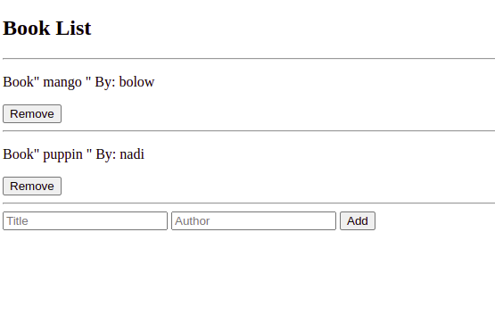

# awesome-books-project

This the awesome book project built with JavaScript

# Awesome books: plain JavaScript with objects

> This is an awesome book project where only basic HTML, and with plain JavaScript Objects are applied.

In this project, We implemented a sratch html file and some of basic JavaScript methods and properties such as Classes, Functions and Events especially with objects.

## Built With

- HTML
- JavaScript.
- Visual Studio Code.
- Linters

## Live Demo

[link](file:///home/moise/awsome-books-project/index.html?)

## Author1

👤 **Zahra Arshia**

- GitHub: [Zahra Arshia](https://github.com/moise-mulungu)
- Twitter: [Zahra Arshia](https://twitter.com/moise_mulungu)
- LinkedIn: [Zahra Arshia](https://www.linkedin.com/in/
mo%C3%AFse-mulungu-a939831b2/)

## Author2

👤 **Moise Mulungu**

- GitHub: [Moise Mulungu](https://github.com/moise-mulungu)
- Twitter: [Moise Mulungu](https://twitter.com/moise_mulungu)
- LinkedIn: [Moise Mulungu](https://www.linkedin.com/in/mo%C3%AFse-mulungu-a939831b2/)

## Design 

- Original design idea by [Cindy Shin in Behance](https://www.behance.net/adagio07) 
- [Design Guideline](https://www.behance.net/gallery/29845175/CC-Global-Summit-2015) 

## 🤝 Contributing

Contributions, issues, and feature requests are welcome!

Feel free to check the [issues page](https://github.com/ZahraArshia/awsome-books-project/issues).

## Show your support

Give a ⭐️ if you like this project!

## 📝 License

This project is [MIT](./MIT.md) licensed.
 
